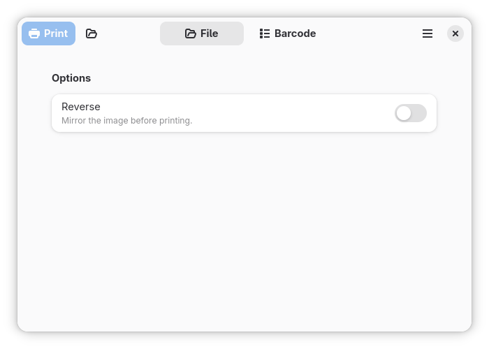

# Lably

A desktop GUI application for printing labels on DYMO Bluetooth label printers.

Lably supports two GUI backends — **Tkinter** (default, no extra dependencies) and **GTK 4 + Libadwaita** — selected at runtime via an environment variable.



## Features

- Print image files directly to a DYMO Bluetooth printer
- Generate and print Code 128 barcodes from text input
- Optional reverse/invert mode for both image and barcode printing
- Two UI backends: classic Tkinter or modern GTK 4 + Libadwaita

## Requirements

- Python 3.8–3.14
- A DYMO Bluetooth label printer
- Bluetooth support on your system
- For the GTK 4 backend: GTK 4 and Libadwaita system libraries

## Installation

Install from source using pip:

```bash
git clone https://github.com/boosterl/lably.git
cd lably
pip install .
```

To include the optional GTK 4 backend:

```bash
pip install ".[gtk4]"
```

## Usage

```bash
lably           # Launch Lably
python -m lably # Run directly as a module
```

Lably automatically uses the GTK 4 + Libadwaita backend when PyGObject is available, and falls back to Tkinter otherwise. To get the GTK 4 UI, install Lably with the `gtk4` extra (see [Installation](#installation)).

### File Picker tab

Browse for an image file on your system and send it to the printer. Check **Reverse** to invert the image before printing.

### Text Field tab

Enter any text and print it as a Code 128 barcode. Check **Reverse** to invert the barcode before printing.

## Development

### Setup

Install in editable mode with development tools:

```bash
git clone https://github.com/boosterl/lably.git
cd lably
pip install -e .
pip install pytest ruff black mypy
```

### Project structure

```
lably/
├── __main__.py               # Entry point
├── core/
│   └── printer.py            # Bluetooth printer logic (async/await)
├── ui/
│   ├── __init__.py           # Factory: create_main_window()
│   └── base_window.py        # Abstract base class for UI backends
└── platforms/
    ├── tk/
    │   └── main_window.py    # Tkinter implementation
    └── gtk4/
        └── main_window.py    # GTK 4 + Libadwaita implementation
```

### Linting and formatting

```bash
ruff check .      # lint
black .           # format
black --check .   # check formatting without modifying files
```

### Type checking

```bash
mypy lably/
```

### Tests

```bash
pytest lably/tests/
pytest -v lably/tests/   # verbose
pytest -x lably/tests/   # stop on first failure
```

## Credits

Bluetooth printer communication is powered by [dymo-bluetooth](https://github.com/ysfchn/dymo-bluetooth) by [@ysfchn](https://github.com/ysfchn). This library handles printer discovery, image preparation, and Bluetooth communication with DYMO label printers.

Barcode generation uses [python-barcode](https://github.com/WhyNotHugo/python-barcode).

## License

GPL-3.0 — see [LICENSE](LICENSE) for details.
